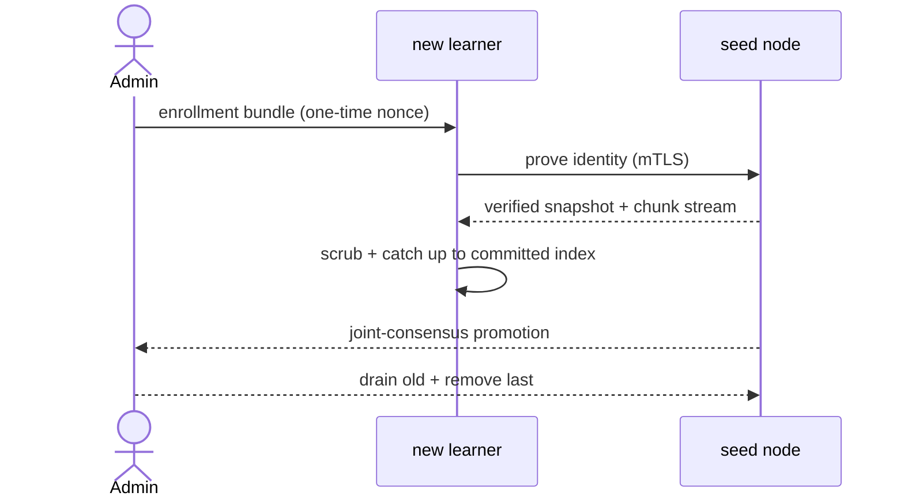

# Membership and bootstrap

Learner-first admission; one membership change at a time (Inv.8).

```mermaid
sequenceDiagram
    actor Admin
    participant Learner as new learner
    participant Seed as seed node
    Admin->>Learner: enrollment bundle (one-time nonce)
    Learner->>Seed: prove identity (mTLS)
    Seed-->>Learner: verified snapshot + chunk stream
    Learner->>Learner: scrub + catch up to committed index
    Seed-->>Admin: joint-consensus promotion
    Admin-->>Seed: drain old + remove last
```
