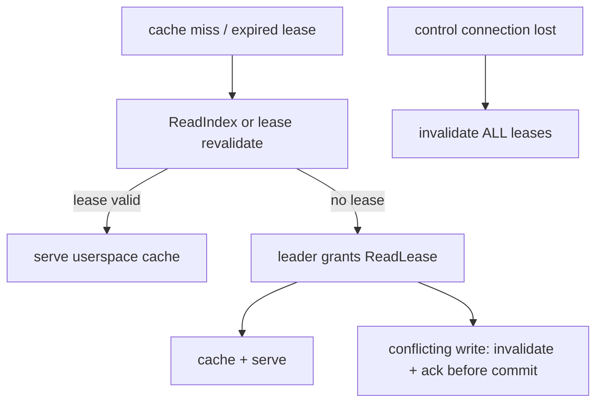

# Read and lease

Strict userspace cache with server leases; a drop of the control connection
invalidates everything (Inv.6).

```mermaid
flowchart TD
    Fresh[cache miss / expired lease] --> RI[ReadIndex or lease revalidate]
    RI -->|lease valid| Hit[serve userspace cache]
    RI -->|no lease| Leader[leader grants ReadLease]
    Leader --> Cached[cache + serve]
    Leader --> Inv[conflicting write: invalidate + ack before commit]
    Drop[control connection lost] --> DropAll[invalidate ALL leases]
```
