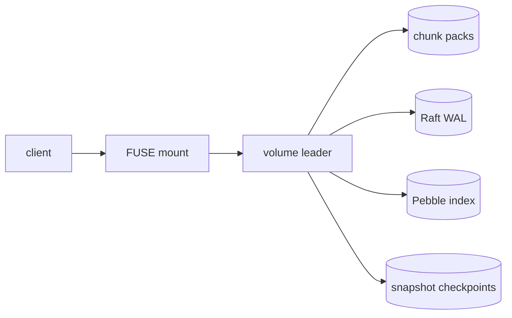

# Storage

Immutable 64 KiB BLAKE3 chunks in append-only packs; Pebble index
(`WriteOptions.Sync`); Raft WAL with fdatasync-before-send; snapshot
checkpoints with checksums.

```mermaid
flowchart LR
    App[client] --> Fuse[FUSE mount]
    Fuse --> Leader[volume leader]
    Leader --> Chunks[(chunk packs)]
    Leader --> WAL[(Raft WAL)]
    Leader --> Pebble[(Pebble index)]
    Leader --> Snap[(snapshot checkpoints)]
```
